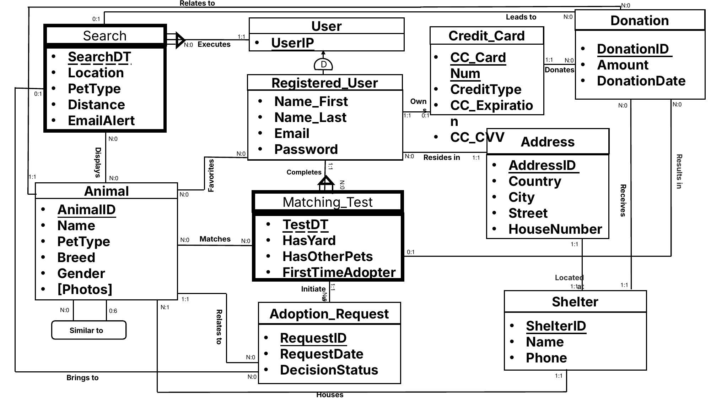
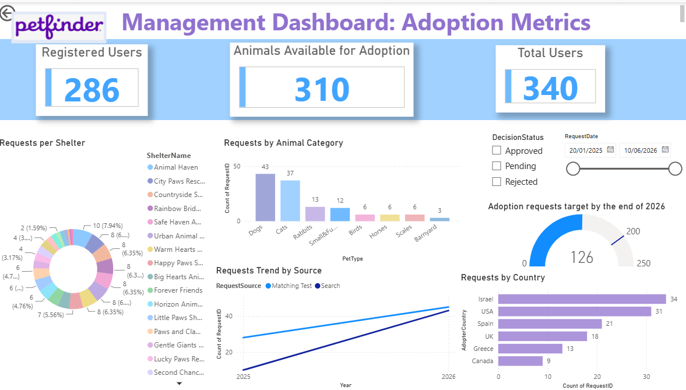
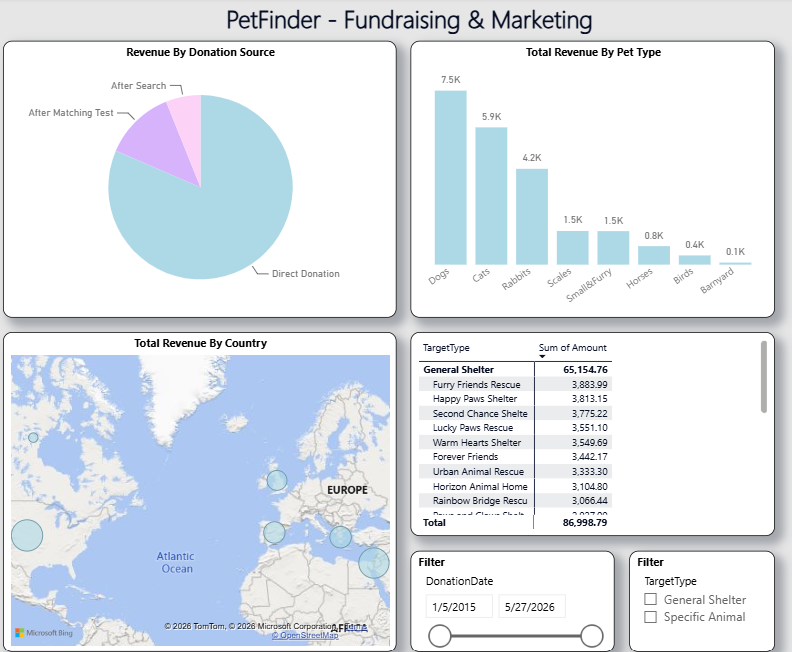

# PetFinder – Pet Adoption Database & Analytics

## What this is
A relational database and BI layer for a pet-adoption platform, modelled on [Petfinder](https://www.petfinder.com/): an online marketplace that connects people who want to adopt with thousands of shelters and rescue groups. The project goes all the way from conceptual design (ERD) through T-SQL implementation in **SQL Server** to two **Power BI** dashboards for management and for the fundraising team.

The schema is based on how the real site works. The data values are mock records created for analysis.

## Data model

The logical model has **15 tables**, built around the adoption funnel:

| Area | Tables |
|---|---|
| Users | `Users` (every visitor, by IP), `Registered_Users` (a disjoint specialisation with personal details), `Addresses`, `Credit_Cards` |
| Animals & shelters | `Animals`, `Photos`, `Shelters`, `Similar_To` (animal ↔ animal) |
| Funnel activity | `Searches` → `Displays` (animals shown per search) · `Favorites` · `Matching_Tests` → `Matches` |
| Outcomes | `Adoption_Requests`, `Donations` |

Key design decisions:
- **Guest vs. registered users.** Anyone can search anonymously. Only registered users can take a matching test, save favourites, submit an adoption request or donate.
- **Funnel attribution.** Adoption requests and donations carry optional foreign keys to the `Search` and/or `Matching_Test` that led to them. This makes it possible to measure which site feature actually converts.
- **No redundant paths.** An adoption request links to an animal, and the animal links to its shelter. There is no direct request → shelter relationship, so the data can't become inconsistent.
- A donation can target a shelter, a specific animal, or both.

## What I built
- **Designed the ERD** and translated it into a normalised relational schema. Composite keys are used for weak entities (`Searches`, `Matching_Tests`).
- **Wrote analytical SQL** ([01_analytical_queries.sql](01_analytical_queries.sql)):
  - Multi-step **CTE** adoption-funnel report (searches → tests → requests), with a requests-per-100-searches metric and an adoption-intent **RANK**
  - **Window functions:** `RANK()` and a running `SUM() OVER` per pet type; `LAG()` for donation-to-donation change per user; `NTILE(4)` donation quartiles
  - Scalar and correlated subqueries, pre-aggregated derived tables that avoid join fan-out, and a **PIVOT** shelter × pet-type matrix
- **Implemented database logic** ([02_views_functions_procedures.sql](02_views_functions_procedures.sql)):
  - A view of animals still available for adoption, plus a scalar and a table-valued function built on it
  - A trigger that keeps each shelter's donation total in sync on every insert, update or delete
  - Stored procedures for adoption decisions (validation → existence check → update → summary) and for donation registration, wrapped in a transaction with **TRY…CATCH** and rollback
- **Optimised queries** using execution plans ([03_query_optimization.sql](03_query_optimization.sql)). Aggregating early in a CTE, before the joins, cut the query's relative plan cost from 60% to 40%.
- **Built two Power BI dashboards** on top of dedicated reporting views ([04_powerbi_views.sql](04_powerbi_views.sql)):
  - **Management – Adoption Metrics:** KPI cards (registered users, animals available, total users), a gauge of requests vs. the year-end target, requests by shelter (the donut acts as a cross-filter for the whole page), by animal category, by country (drill-down to city) and a trend by source (search vs. matching test), with status and date slicers
  - **Fundraising & Marketing:** revenue by donation source, by pet type (drill-down to breed), a geographic bubble map (country → city), and top shelters and animals by amount raised

## Key insights
- **Most donation revenue comes from direct donations.** Only a small share arrives after a search or a matching test, so the funnel features that drive adoptions barely convert into donations. A donation prompt inside the matching-test flow is an obvious experiment to try.
- **Dogs and cats dominate both demand and giving.** They lead adoption requests (43 and 37) and donation revenue (about 7.5K and 5.9K). Rabbits are a clear third, which suggests campaign creative should lead with dogs and cats while giving long-tail categories extra exposure.
- **Adoption requests are behind target.** There are 126 requests against a year-end target of 200, so management needs to act to close the gap.
- **Demand is geographically concentrated.** Israel (34) and the USA (31) account for about half of all requests, followed by Spain and the UK. That points to where ad budget would be most efficient.

## Tech stack
SQL Server (T-SQL), Power BI

## Screenshots
**Management dashboard – Adoption Metrics**

**Fundraising & Marketing report**

